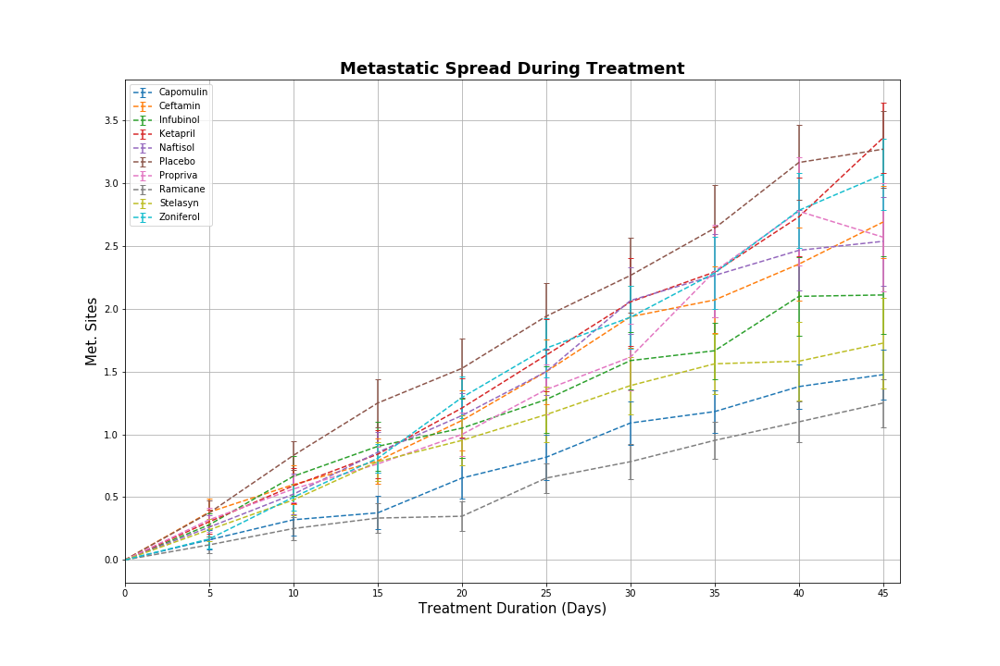

## Chart Plotting using Uber data

Objective to build a [Bubble Plot](https://en.wikipedia.org/wiki/Bubble_chart) that showcases the relationship between four key variables:

* Average Fare ($) Per City
* Total Number of Rides Per City
* Total Number of Drivers Per City
* City Type (Urban, Suburban, Rural)

In addition, produce the following three pie charts:

* % of Total Fares by City Type

* % of Total Rides by City Type.png)

* % of Total Drivers by City Type

## Chart Plotting using pharmaceutical data

* Creating a scatter plot that shows how the tumor volume changes over time for each treatment.

* Creating a scatter plot that shows how the number of [metastatic](https://en.wikipedia.org/wiki/Metastasis) (cancer spreading) sites changes over time for each treatment.

* Creating a scatter plot that shows the number of mice still alive through the course of treatment (Survival Rate)

* Creating a bar graph that compares the total % tumor volume change for each drug across the full 45 days.

